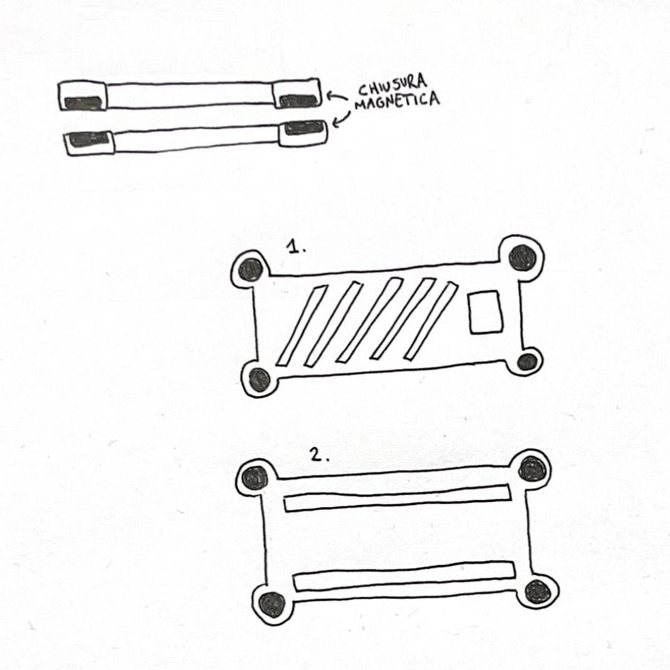

# Magnetic Case for Arduino Nano  

## Overview  
This project provides a 3D-printable case for the Arduino Nano with an integrated magnetic mounting system. The case ensures secure housing for your board while allowing easy access to pins and connectors. Its lightweight and durable design makes it ideal for both prototyping and permanent installations.  


*Sketch designed for Arduino Nano.* 

## Features  
- **Compact Design:** Perfectly fits the Arduino Nano.  
- **Magnetic Mounting:** Built-in slots for neodymium magnets for quick and secure attachment to metallic surfaces.  
- **Easy Assembly:** Designed with accessibility in mind for quick setup.  
- **Customizable:** STL files can be edited to fit your specific needs.  

## Contents  
- `magneticCase.stl` - STL file.

## Requirements  
### Materials  
- Arduino Nano.  
- 4 x cylindrical magnets.  

### Tools  
- 3D Printer (or access to one).   

## Getting Started  
1. **Download the STL files**:  
   Clone the repository or download the STL files. 
   ```bash
   git clone https://github.com/your-username/magnetic-case-arduino-nano.git
   ```
